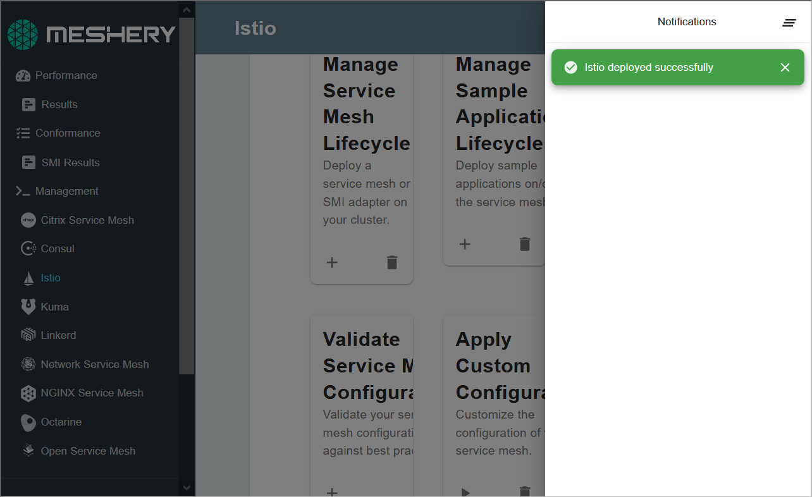

This session will auto-install **`minikube`** and set up other environment variables, necessary to run Meshery for you. This may take up to 2 minutes. 

After the environment has been setup, you may check up on your cluster nodes by running(1):
`kubectl get nodes`{{execute}}

## Set up Meshery

Meshery can be downloaded, installed, deployed and auto-launched with a single command:

`curl -L https://git.io/meshery | PLATFORM=docker bash -`{{execute}}

**Congratulations!** You have successfully installed Meshery.

Meshery is auto launched at host:`9081`. 

For this tutorial session, the **Meshery Server** tab is configured to be listening at `http://localhost:9081`/

- Click on the **Meshery Server** tab
- Click on **Display Port**

**Welcome to Meshery!**

Choose **None** as your provider for now and get started.

## Connect your cluster with Meshery

Meshery will auto-connect with your Minikube cluster by loading the kubeconfig found in your `$HOME/.kube` folder.

**Check up on your connection**

You may check up on the connections between Meshery and your server anytime by performing `ad hoc` tests to ensure a successful connections:

1. Between Meshery and your cluster - Click on your `configuration name` (in this scenario, `minikube`)

2. Between Meshery and your chosen adapter by clicking on the adapter name corresponding to the service mesh you have installed

