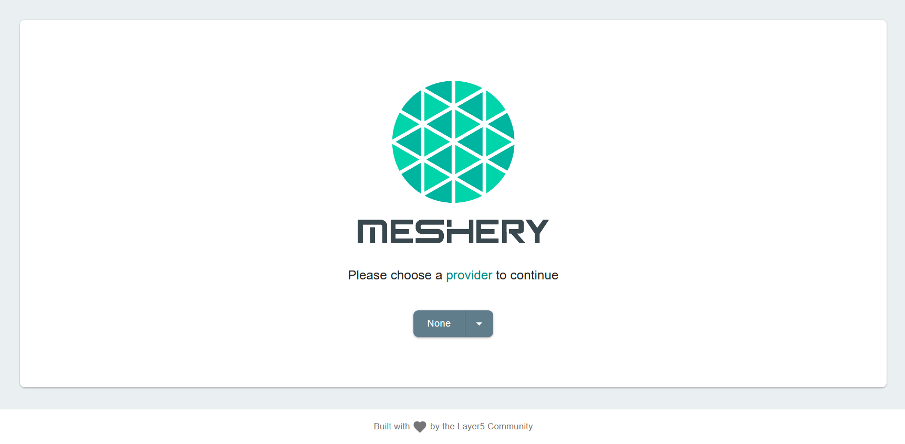
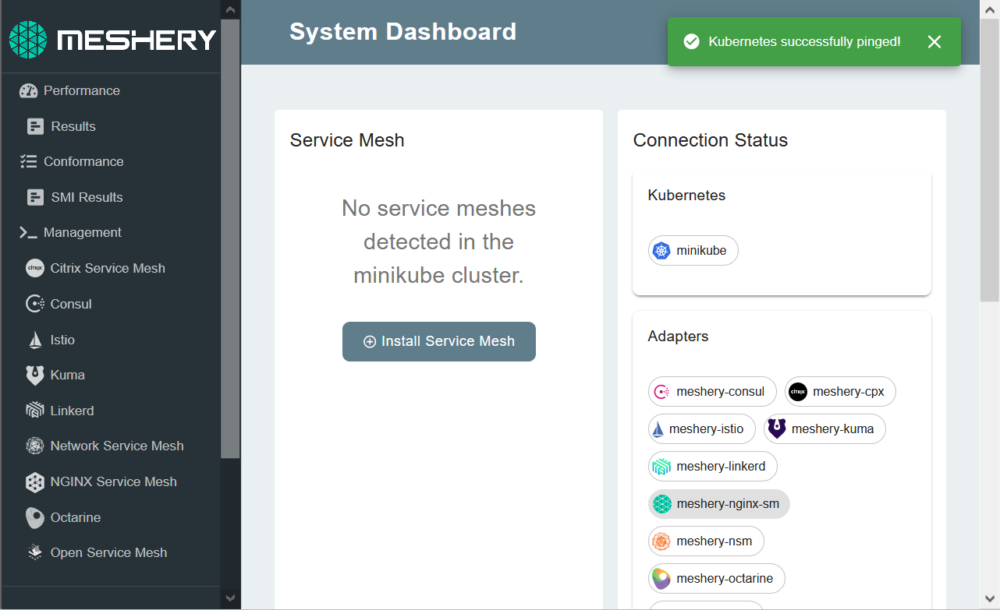

This lab starts by initializing a Kuberentes cluster, which may take a few moments to be available. You can check on your cluster availability by executing:

`kubectl get nodes`{{execute}}

Once ready, you can deploy Meshery.

## Setup Meshery

Meshery can be downloaded, installed, and launched with a single commandd:

`curl -L https://git.io/meshery | ADAPTERS=istio PLATFORM=docker bash -`{{execute}}

**Congratulations!** You have successfully installed Meshery and the Meshery Adapter for Linkerd.

Meshery is now available at host:`9081`.

Find the **Meshery UI** tab is configured to be listening at `http://localhost:9081`/

- Click on the **Meshery UI** tab
- Click on **Display Port**

**Welcome to Meshery!**

Choose **Meshery** as your provider. Sign in to get started.

## Connect your cluster with Meshery

Meshery will auto-connect with your Kubernetes by loading the kubeconfig found in your `$HOME/.kube` folder.

**Verify your connections**

1. Between Meshery and Kubernetes.
2. Between Meshery and the Meshery Adapter for your corresponding service mesh.

